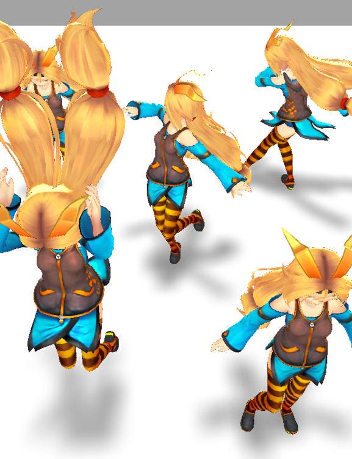

# Unityで床に低負荷なブラー付きの影をで表示する
### Fast Floor-only Deformed Shadow

## 概要
#
高速なブラー付き影を地面のみに表示します。モバイル端末で利用することを目的としています。簡略モデル（BoxUnityChan.fbx）を光線方向からのCameraで撮影してブラーをかけることで影を生成しています。

## TODO
* BoxUnityChan.fbx に相当するものを自動生成すること。
* Cameraを使わずに地面に置いたMeshを上手く動かすような方法を試す。

## ユニティちゃんについて

 Assets/UnityChan/ 以下のアセットのは、『<a href="http://unity-chan.com/contents/license_jp/" target="_blank">ユニティちゃんライセンス</a>』で提供されています。このアセットをご利用される場合は、『<a href="http://unity-chan.com/contents/guideline/" target="_blank">キャラクター利用のガイドライン</a>』も併せてご確認ください。

